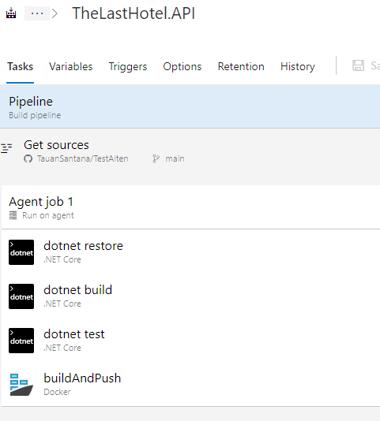

# Devops
Ce projet incluait des devops utilisant **[Azure DevOps](https://azure.microsoft.com/pt-br/services/devops/)** où chaque fois qu'un code est publié par le développeur, un déclencheur est démarré dans Azure Devops qui construit, exécute les tests, génère une image Docker et la publie sur le serveur de production (le seul jusqu'à présent).

### Des détails:
Un projet appelé "The Last Hotel" et il contient le *Pipeline* et les *Releases* configurés pour construire et publier le projet.

### **Pipelines**:
 

> Des détails:
> * dotnet restore: restaure les packages nuget du projet.
> * dotnet build: construit le projet et valide s'il y a des erreurs.
> * dotnet test: effectue des tests unitaires.
> * buildAndPush: construit l'image Docker à l'aide du fichier DockerFile dans l'API
 
 

### **Release**:
  

> Des détails:
> * Artefact: C'est la source du code source. Dans ce cas, Pipeline *TheLastHotel.API*. (Ceci est déjà configuré avec un déclencheur à déclencher chaque fois que le pipeline *TheLastHotel.API* s'exécute avec succès et démarre la version.)
> * Stage: Ils sont les environnements disponibles pour le déploiement de l'application.

 

 

> Des détails: 
> Il n'y a qu'une seule tâche configurée pour être déployée dans cette version.   
> Cette tâche dispose des paramètres nécessaires pour déployer la version générée dans le pipeline dans le conteneur WebApp configuré.