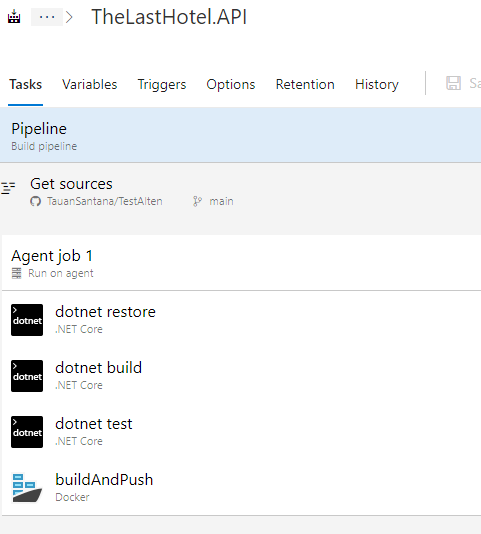
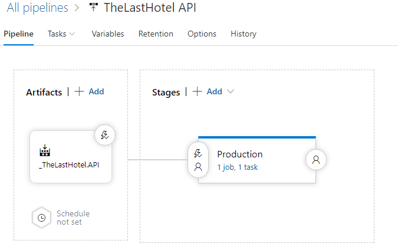
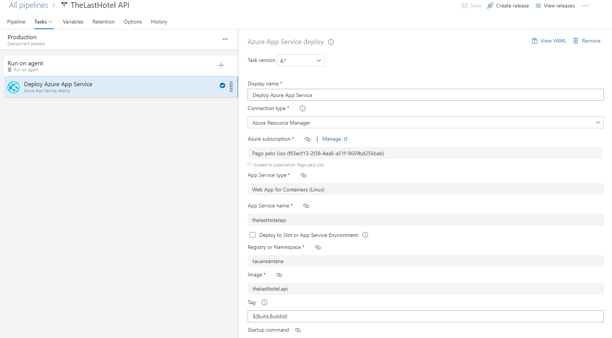

# Devops
This project included devops using **[Azure DevOps](https://azure.microsoft.com/pt-br/services/devops/)** where every time a code is released by the developer, a trigger is started in Azure Devops that builds, runs the tests, generates a Docker image and publishes it on the production server (the only until now).

### Details:
A project called "The Last Hotel" and it contains the *Pipeline* and *Releases* configured to build and release the project.

### **Pipelines**:
 
>Details:
> * dotnet restore: Restores the project's nuget packages.
> * dotnet build: builds the project and validates if there are errors.
> * dotnet test: performs unit tests.
> * buildAndPush: builds the Docker image using the DockerFile file in the API
 
 
### **Release**:
  
>Details:
> * Artifact: It is the source of the source code. In this case, Pipeline *TheLastHotel.API*. (This is already configured with a trigger to be triggered every time the *TheLastHotel.API* pipeline runs successfully and starts the release.)
> * Stage: These are the environments available for deploying the application.

 
 

> Details:
> There is only one task configured to deploy in this release.  
> This task has the necessary settings to deploy the version generated in the pipeline in the configured WebApp Container.