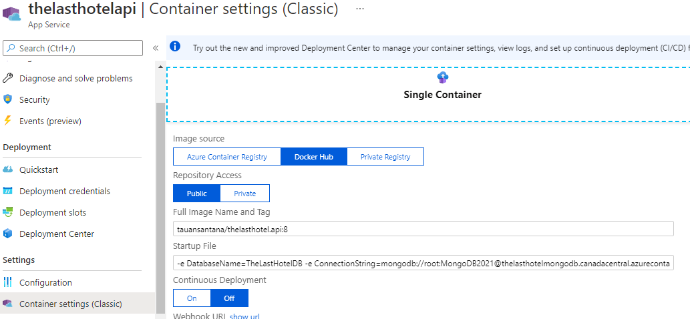
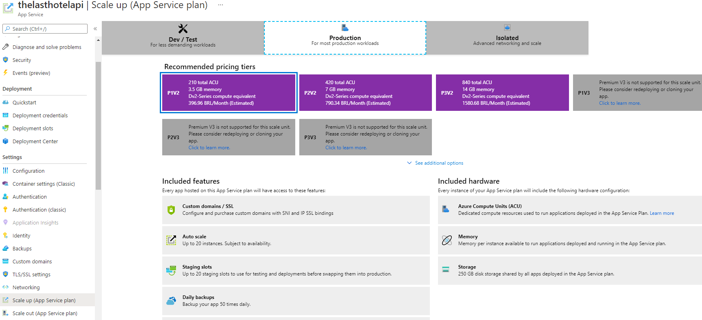
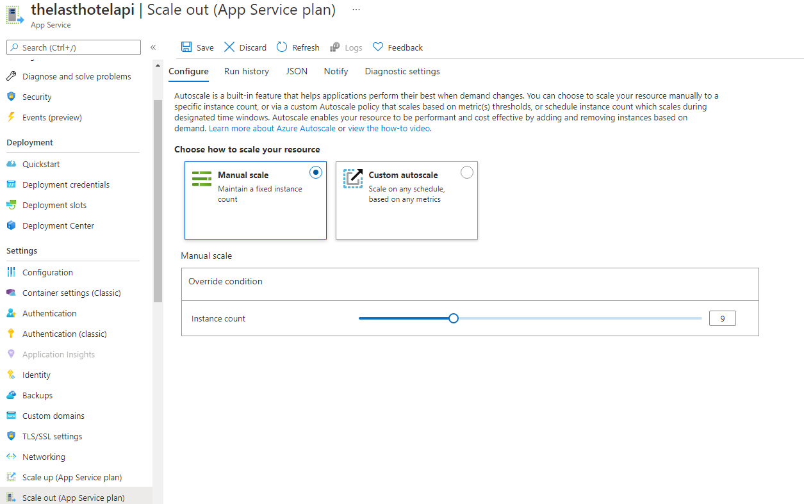

# Scalability

L'une des prémisses du projet est qu'il était évolutif et c'est pourquoi certaines décisions ont été prises pour rendre cela possible.

## L'utilisation du conteneur
Possibilité de conteneur pour empaqueter l'application et toutes ses dépendances et l'exécuter, essentiellement, sur n'importe quel serveur Linux ou Windows.  

Le conteneur *TheLastHotel.API* peut être exécuté dans un cluster Docker Swarm ou dans un cluster Kubernetes local, si l'utilisation du cloud pose un problème, par exemple.  

## Nuage
L'exécution de ce projet dans un cloud est recommandée car il existe plusieurs services qui facilitent l'évolutivité et fournissent la sécurité nécessaire à cet effet.

> Utilisé dans le projet: 
> Le service Web App (conteneur) dans Azure a été choisi pour le scénario d'évolutivité.  
> Il fournit plusieurs couches de prix et différentes configurations pour une évolutivité verticale et horizontale, en plus d'une surveillance étendue, la possibilité de configurer facilement des alertes et SSL.

 
 
Configuration de l'application Web pour le conteneur
 
 
 
Possibilité de modifier la couche de prix en fonction des fonctionnalités souhaitées
 
 
 

Il y a la possibilité de mettre à l'échelle manuellement et automatiquement.  
**Manuellement**: l'utilisateur ajuste le nombre d'instances qu'il souhaite. 
**Automatiquement**: l'utilisateur crée une règle de surveillance, telle que la limite CPU requise en % qu'il souhaite démarrer la balance. 
 
 

## **Suggestions d'amélioration pour le projet.**
Utilisation du cache sur les points de terminaison de requête.  
Cela réduira les déplacements vers la base de données et améliorera les performances. 
Une possibilité est d'utiliser Redis, car il est léger, rapide et facile à entretenir. 