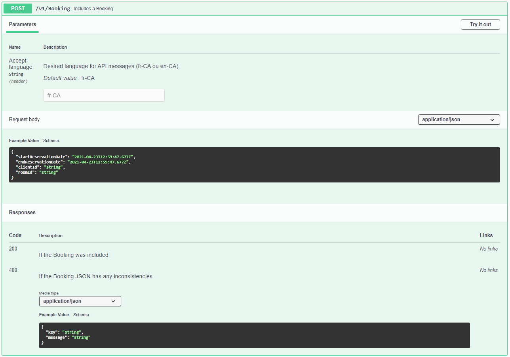

# TheLastHotel.API
C'est l'interface d'interaction utilisateur/système.
Il s'agit d'un projet WebAPI de base ASP.NET qui expose tous les points de terminaison pour les opérations de service.
De plus, il fournit une documentation interactive **(Swagger)** accessible via la route "/swagger".

### Contrôleurs:
Dans l'API, il existe un contrôleur pour chaque contexte métier:
* BookingController
* ClientController
* RoomController 

>Gestion des versions d'API  
>Tous les contrôleurs ont la version initiale comme préfixe de route, ainsi que le dossier où ils se trouvent (Ex.: V1)

### Injection de dépendance:
Dans le dossier *DependencyInjection*, il y a un fichier appelé DIContainer où les mappages des injections de dépendances du projet sont effectués. 
Les méthodes *RegisterRepository* et *RegisterServices* sont appelées par la classe Startup. 
>Les référentiels sont configurés comme **Scoped** car la même instance peut être utilisée en même temps par d'autres services 
>Les services sont configurés comme **Transient** car une nouvelle instance est requise à chaque exécution, car il ne peut y avoir de concurrence des requêtes utilisant les mêmes objets, ce qui peut interférer dans la validation des règles.

### Des modèles & AutoMapper
Dans ce projet, le package **AutoMapper** a été utilisé pour établir une connexion entre les données arrivant via une requête Web et les classes de domaine. 
Cela empêche une méthode POST, par exemple, d'atteindre des propriétés que vous ne souhaitez pas inclure mais qui sont présentes dans la classe de domaine. 
Le mappage complet du Domaine X Model  est effectué dans la classe **AutoMappingProfile** qui hérite de Profile, une classe AutoMapper. 

### Swagger (documentation interactive)
Une documentation interactive est disponible sur cette API. 
Il s'agit d'un portail Web avec tous les points finaux disponibles dans l'API avec une description de la fonctionnalité de chacun et de ses paramètres respectifs d'entrée et de sortie. 
Ce portail est disponible sur url /swagger.  

  
*Détails d'une méthode POST.*  

