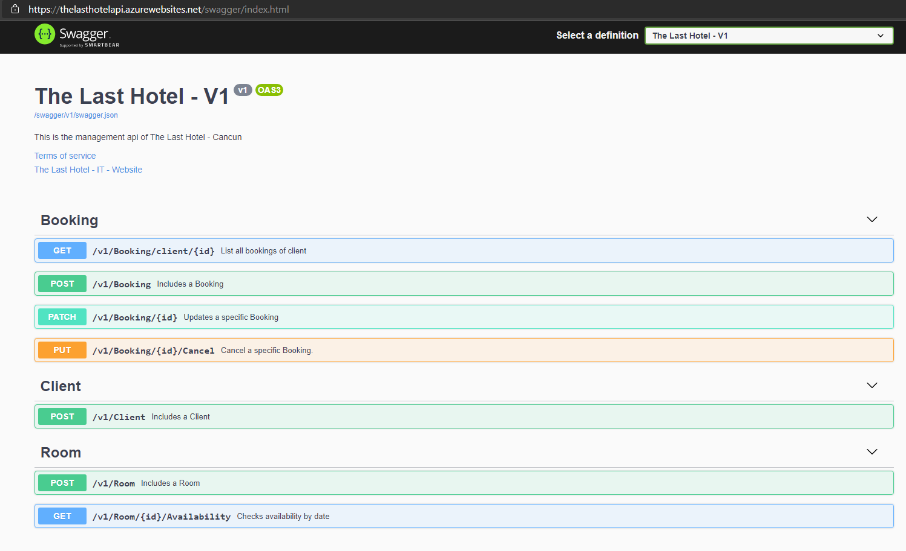
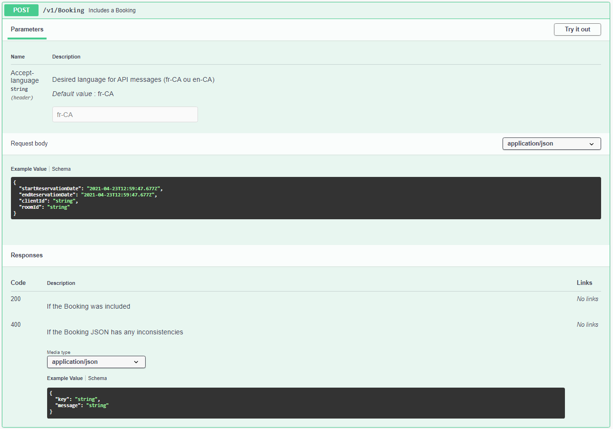

# TheLastHotel.API
It is the user/system interaction interface.   
It is an ASP.NET core WebAPI project that exposes all endpoints for service operations.    
In addition, it provides interactive documentation **(Swagger)** accessible via the "/swagger" route.

### Controllers:
In the API there is a controller for each business context:
* BookingController
* ClientController
* RoomController   

>API versioning  
>All controllers have the initial version as a route prefix, as well as the folder where they are located (Ex .: V1)

### Dependency Injection:
Inside the folder *DependencyInjection* there is a file called DIContainer where mappings of the project's dependency injections are made. 
The *RegisterRepository* and *RegisterServices* methods are called by the Startup class. 
>The repositories are configured as **Scoped** because the same instance can be used at the same time by other services 
>The services are configured as **Transient** because a new instance is required for each time it is executed, as there can be no concurrency of requests using the same objects, which can interfere in the validation of the rules.

### Models & AutoMapper
In this project, the **AutoMapper** package was used to make a connection between data arriving via web request and domain classes. 
This prevents a POST method, for example, from reaching properties that you do not want to be included but that are present in the domain class. 
The entire Model X Domain mapping is performed in the **AutoMappingProfile** class that inherits from Profile, an AutoMapper class. 

### Swagger (interactive documentation)
Interactive documentation is available on this API. 
It is a web portal with all the end points available in the API with a description of the functionality of each one and its respective parameters input and output parameters. 
This portal is available at url /swagger.  

  
*Details of a POST method.*  

