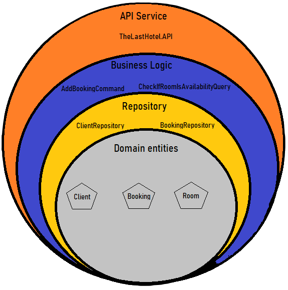

# The Last Hotel - API
> ### **Autres langues:**
> [Anglais](/README.md)

 
"The Last Hotel" est un exemple de projet de gestion des réservations, des chambres et des clients de l'hôtel.
 
Ce projet a été conçu pour être évolutif et multiplateforme,
par conséquent, .Net Core et Docker ont été utilisés depuis la conception.

## Exigences de développement:
* [Visual Studio >= 2019](https://visualstudio.microsoft.com/pt-br/downloads/)
* [.NET Core 3.1](https://dotnet.microsoft.com/download/dotnet/3.1)
* [Docker for Desktop](https://www.docker.com/products/docker-desktop)

## Exigences non fonctionnelles:
| **[DevOps](./Doc/DevOps.fr-CA.md)** |  
| **[Évolutivité](./Doc/Scalability.fr-CA.md)** |
## API Routes:

ATTENTION:
* Toute la documentation de le routage est accessible via le point de terminaison: **/swagger**
* Toutes les routes sont versionnées avec le préfixe **"v1"**
  
| Méthode | URL | La description 
| --- | --- | --- |
|GET |/v1/Booking/client/{id} |Lister toutes les réservations du client|
|POST |/v1/Booking |Comprend une réservation|
|PATCH |/v1/Booking/{id} |Met à jour une réservation spécifique|
|POST |/v1/Client |Comprend un client|
|POST |/v1/Room |Comprend un Room|
|GET |/v1​/Room​/{id}​/Availability |Vérifie la disponibilité par date|
|  |   |
## Architecture division:
Le projet est divisé en 6 parties (*Cliquez sur les projets ci-dessous pour plus de détails*):

| Projet | La description 
| --- | --- |
|**[docker-compose](./Doc/Docker-Compose.fr-CA.md)**|Utilisé pour exécuter le projet localement (exécuter le fichier docker-compose.yml qui contient l'API plus la base de données pour les tests)|
|**[TheLastHotel.API](./Doc/TheLastHotel.API.fr-CA.md)**|API qui contient toute la configuration des routes et qui exécute la logique métier|
|**[TheLastHotel.Domain](./Doc/TheLastHotel.Domain.fr-CA.md)**|Contient toutes les classes qui représentent l'entreprise, telles que: 'Booking', 'Room' and 'Client'|
|**[TheLastHotel.Repository](./Doc/TheLastHotel.Repository.fr-CA.md)**|Contient le référentiel générique pour accéder aux données et les référentiels respectifs pour travailler avec les classes de domaine.|
|**[TheLastHotel.Service](./Doc/TheLastHotel.Service.fr-CA.md)**|Contient tous les services pour conserver les données et valider les règles métier. Chaque contexte métier contient la division Queries et Commands implémentant la logique métier.|
|**TheLastHotel.Tests**|Il contient les tests unitaires qui valident le code de toutes les couches précédentes.*(En cours)*|
|  |   |
    
 ## Détails de l'architecture:

 

* **"L'Entités de domaine"** est représenté par le projet **'TheLastHotel.Domain'**. Contient toutes les classes de domaine utilisées dans le projet.
  

* Le **"Repository"** est représenté par le projet **'TheLastHotel.Repository'**.
Contient toutes les classes du référentiel utilisées par les services et commandes contenus dans le projet "TheLastHotel.Service".
En outre, contient un référentiel générique qui peut être utilisé par MongoDB (>=3.5) et Azure CosmosDB en utilisant l'API MongoDB *(où peut évoluer plus facilement)*.
À l'intérieur de "TheLastHotel.Repository" contient le dossier Database. Contient le référentiel générique et des paramètres supplémentaires pour les requêtes à effectuer avec Linq et non avec du texte *(évitant les problèmes d'orthographe)*.
* La **"Business Logic"** est représentée par le **"TheLastHotel.Service"**. Contient toutes les opérations, la logique et les validations métier.
* Le **"Service API"** est représenté par le **"TheLastHotel.API"**. Il s'agit de la couche d'interaction utilisateur/système. Contient les points de terminaison exposés pour l'accès et toute la logique de routage d'API.
Il contient la configuration et les paramètres d'injection de dépendances pour la base de données qui sera utilisée dans les couches précédentes.

* **(Extra - Pour le développement) Docker-compose**. C'est un projet supplémentaire dans la solution pour exécuter le projet à l'aide de Docker. Il utilise le fichier "docker-compose.yml" pour exécuter l'API et MongoDB localement pour le développement.

